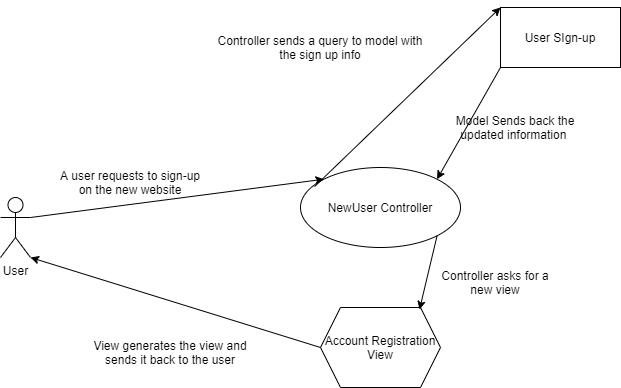
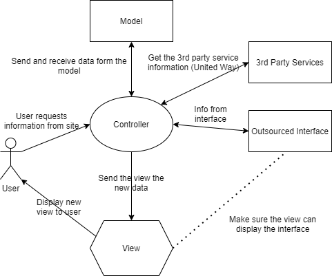

# Lab Report: Continuous Integration
___
**Course:** CIS 411, Spring 2021  
**Instructor(s):** [Trevor Bunch](https://github.com/trevordbunch)  
**Name:** Joseph Tonnies  
**GitHub Handle:** Jmtonnies  
**Repository:**  https://github.com/Jmtonnies/cis411_lab2_arch
**Collaborators:** Alecclyde, ArturD0nnelly

# Step 1: Confirm Lab Setup
- [ ✓ ] I have forked the repository and created my lab report
- [ ✓ ] I have reviewed the [lecture / discsussion](../assets/04p1_SolutionArchitectures.pdf) on architecture patterns.
- [ ✓ ] If I'm collaborating on this project, I have included their handles on the report and confirm that my report is informed, but not copied from my collaborators.

# Step 2: Analyze the Proposal
Creating a user tracking, volunteer system that allows application submission, and company / event tracking all in one website.

## Step 2.1 Representative Use Cases  

| Request to join a volunteer event | |
|---|---|
| Actor: Volunteer | |
| Preconditions: 1. The perspective volunteer is already registered on the app  2. A company has posted a listing| |
| Description / Steps: 1.0 Request to join a volunteer event <dd>1. User specifies a certain event they would like to volunteer for <dd>2. The system verifies that the posting is valid (time, date, is it cancelled). <dd>3. The system checks to see if the event is full. <dd>4. The system asks the user what times they would like to volunteer. <dd>5. The user selects the time slots they would like to volunteer for. <dd>6. The system asks user to confirm their selection of times <dd>7. The system sends a reminder near the time of the Volunteers time slot <dd>8. The system tracks the users time of volunteership and job description for later review by user | |
| Postconditions: <dd>1. The user actually volunteers at the event <dd>2. The system sends a reminder <dd>3. the system record time and date the user volunteered | |

| Adding a volunteer event or position | |
|---|---|
| Actor: Service Agencies | |
| Preconditions: <dd>1. A company or person is registered and verified with the app <dd>2. The company or person has a volunteer event | |
| Description / Steps 1.0 Request to add an event or position  <dd>1. A company or person specifies a day and time they will be having a volunteer position or event <dd>2.The system records the date and time within the system <dd>3. The System notifys the company or person that there listing was posted successfully. <dd>4.The system notifies other users that a new posting has been listed. | |
| Postconditions  <dd>1. The system successfully accepts and signs volunteers up.| |

## Step 2.2 Define the MVC Components

| Model | View | Controller |
|---|---|---|
| Organizations | Organization Profile page | OrgView Controller |
| Volunteers | Volunteer UI / Home Page | VolView Controller |
| Event List | Events that are available  | EventView Controller |
| User Sign-up | Account Registration Page | NewUser Controller |

## Step 2.3 Diagram a Use Case in Architectural Terms

A user is trying to sign up for the new app. The user enters their data into the website. The controller will take that data and give it to the model which will modify a database and enter the new users data. THe model will then send the new data back to the controller. The controller will then send that new data to the view which will generate a new webpage for the user the controller will then receive  that view and broadcast it to the user.  

# Step 3: Enhancing an Architecture

## Step 3.1 Architecture Change Proposal
I would personally keep the MVC architecture. Like we talked about in class adding on 3rd party apps is no big deal as they can be directly linked into the controller. To include a specific interface may be hard. I would think to include a interface I would either outsource it to another 3rd party app and just include it through the controller to send to the view or make it in house and include it through the model. This would mean the model would be accessed much more frequently especially if it was imbedded in other sites. When looking through other possible architectures microservice, or broker. Both architectures support future growth and have a lot of flexibility when dealing with distributing workloads and linking in API’s or 3rd party software. One issue that I could see happening sticking with MVC is that with growth there will need to be major infrastructure upgrades especially if other websites would be using your interface.

## Step 3.2 Revised Architecture Diagram

The new diagram shows that we can now integrate the 3rd party sources and the outsourced interface through the controller. We would need to rebuild the view so that it reflects the interface so the proper view can be displayed.
# Step 4: Scaling an Architecture
I do not see much change that you would need with the existing architecture except that you would need to do major up-scaling. The increased number of users could be handled with just an upscale in servers and server speeds. If needed there could even be spill over servers to keep the 15 second response time. All these requirements would require more API’s to keep track of the numbers and response times but those can be added in through the controller. To allow researchers to examine our data I would create a clone off the controller to track and document everything that is happening so that anything given over to the researchers would not be live data. One consequence of keeping MVC is that each controller is handling A LOT of data and there could possibly be backups but if you keep adding more controllers and processing power the MVC should be able to last a long time. We would also need to check on outsourced interfaces and 3rd party services to see if they can keep up with the demand from the website and future app. I would build the app almost exactly like the website just with a new and improved mobile view. 
Overall, not much change would need to be made to the architecture itself. Just a few more branches for more API’s and recording of the data. 

