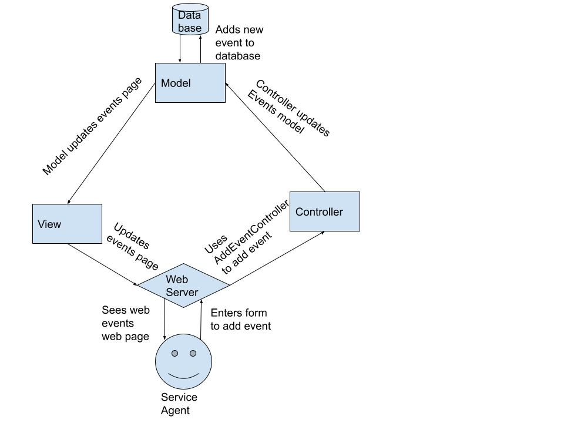

# Lab Report: Continuous Integration
___
**Course:** CIS 411, Spring 2021  
**Instructor(s):** [Trevor Bunch](https://github.com/trevordbunch)  
**Name:** Your Name  
**GitHub Handle:** Your GitHub Handle  
**Repository:** Your Forked Repository  
**Collaborators:** 
___

# Step 1: Confirm Lab Setup
- [X] I have forked the repository and created my lab report
- [X] I have reviewed the [lecture / discussion](../assets/04p1_SolutionArchitectures.pdf) on architecture patterns.
- [X] If I'm collaborating on this project, I have included their handles on the report and confirm that my report is informed, but not copied from my collaborators.

# Step 2: Analyze the Proposal
Serve Central ... ENTER A BASIC SYSTEM INTRODUCTION HERE (1-2 Sentences).
- ServeCentral is an app that makes it easier to find and sign up for volunteer opportunities. The app stores all event and company information and all user information.
## Step 2.1 Representative Use Cases  

| Use Case #1 |Volunteer|
|---|---|
| Title |Sign up for event|
| Description / Steps |This use case describes how the volunteer would sign up for an event|
| Primary Actor |Volunteer|
| Preconditions |The User has created an account and logged in. Events database is available and on-line. There are events to sign up for.|
| Postconditions |The user is added to the list of volunteers for the event.|

| Use Case #2 |Service agencies|
|---|---|
| Title |Add an event|
| Description / Steps |This use case describes how the service agencies would add an event|
| Primary Actor |Service agency|
| Preconditions |Service agency is authorized. Service agency has added their company information. Events database is available and on-line|
| Postconditions |The event is stored on the events database|

## Step 2.2 Define the MVC Components

| Model | View | Controller |
|---|---|---|
|Profile|Profile Page|EditProfileController|
|Events|Events Page|AddEventController|
|Map|Map Page|JoinEventController|
|Company Information|Company Page|EditCompanyInformationController|

## Step 2.3 Diagram a Use Case in Architectural Terms

# Step 3: Enhancing an Architecture

## Step 3.1 Architecture Change Proposal
INSERT Architectural change proposal here, and how it meets the two new requirements.  Explain both the benefits and draw backs of your proposal.
- I think sticking to MVC is the best option because none of the new requirements really demand switching to a new architectural pattern. The benefit of staying as MVC is that adding the new features will be easier than completely changing the architecture. The draw back of swapping though is that MVC can tend to get overcomplicated the more you add to it.
## Step 3.2 Revised Architecture Diagram

# Step 4: Scaling an Architecture
INSERT Architectural change proposal here, and how it meets the four new requirements.  Explain both the benefits and draw backs of your proposal.  If the changes are significant, then you need to explain why the changes are necessary versus a nice-to-have enhancement.

I would use a microservice architectural pattern. It would have low latency due to only having to interact with the necessary functions. Each microservice would be able to have it's own database that can be expanded as it grows to need more space. It would be easy to set up a microservice to track patterns of of volunteer opportunities.
# Extra Credit
If you opt to do extra credit, then include it here.