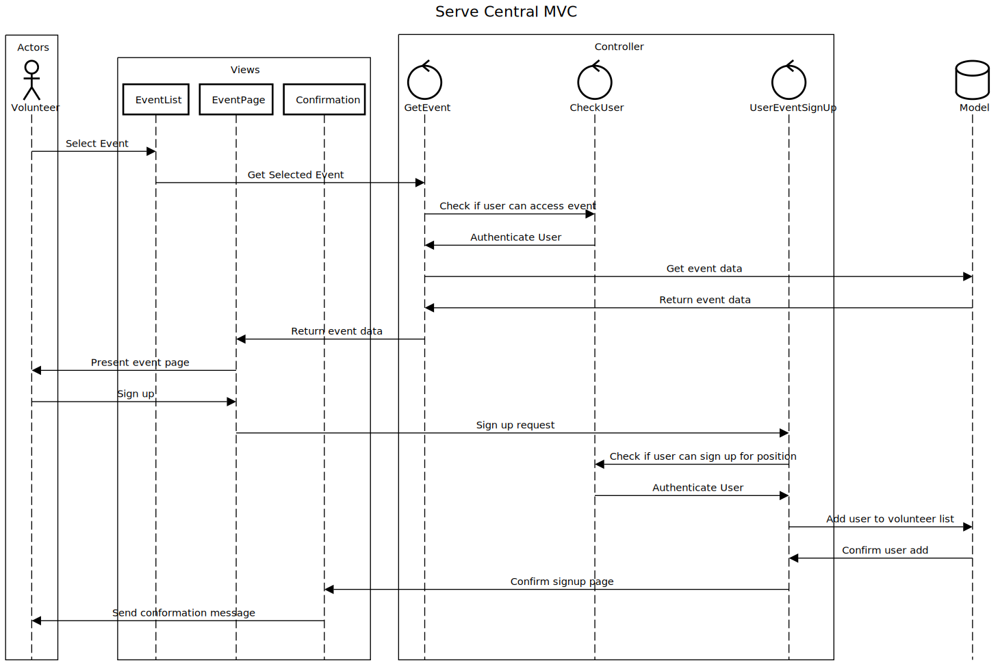
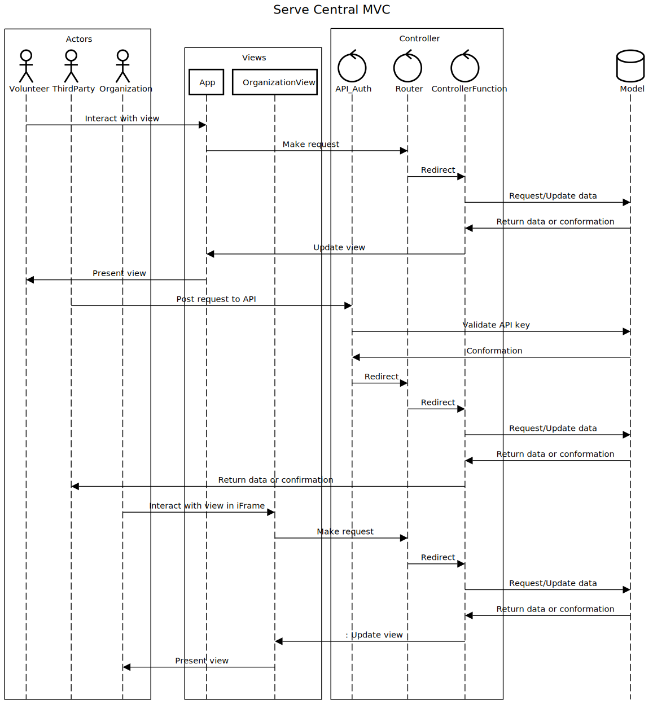

# Lab Report: Continuous Integration
___
**Course:** CIS 411, Spring 2021  
**Instructor(s):** [Trevor Bunch](https://github.com/trevordbunch)  
**Name:** Josiah McCracken  
**GitHub Handle:** Scribhneoir  
**Repository:** [Repo](https://github.com/scribhneoir/cis411_lab2_arch)  
**Collaborators:** airgo32 & mcjo163
___

# Step 1: Confirm Lab Setup
- [x] I have forked the repository and created my lab report
- [x] I have reviewed the [lecture / discsussion](../assets/04p1_SolutionArchitectures.pdf) on architecture patterns.
- [x] If I'm collaborating on this project, I have included their handles on the report and confirm that my report is informed, but not copied from my collaborators.

# Step 2: Analyze the Proposal
Serve Central is a mobile application developed to inform users of volunteer opportunities (including details ) and provide a seemless method of registration.

## Step 2.1 Representative Use Cases  

| Use Case #1 | |
|---|---|
| Title | Register for Event |
| Description / Steps | User selects an event, chooses a position and timeslot he is eligable for, and presses the register button |
| Primary Actor | Volunteer |
| Preconditions | User is registered, Event exists, user is eligable to volunteer, user is registering before the deadline, user has selected a time slot and elligable position to fill |
| Postconditions | User's name and contact information is added to the volunteer list, User is emailed a confirmation with an attached callendar event for the slated time slot |

| Use Case #2 | |
|---|---|
| Title | Pull Volunteer List for Event |
| Description / Steps | A representative of the service agency selects an agency owned event that's sign up date has expired and clicks the link to download the list of volunteers|
| Primary Actor | Service Agency |
| Preconditions | Event exists, user has propper clearence for that agency / event, users have volunteered for the event, the signup deadline has passed |
| Postconditions | A list of volunteers with names, contact information, volunteer positions, and time slots |

## Step 2.2 Define the MVC Components

| Model | View | Controller |
|---|---|---|
| Events | Event Map | Event Signup |
| Vollunteers | User Profile | Create User |
| Service Agencies | Event Signup | Create Event |
| Event Catagories | Service Agency Page | Get Events |

## Step 2.3 Diagram a Use Case in Architectural Terms
  

# Step 3: Enhancing an Architecture

## Step 3.1 Architecture Change Proposal
I would recommend keeping the MVC architecture, as it can easily be modified to fill these new requirements without complete restructure of the project. By providing API documentation and allowing service organizations to create api keys to securely post requests to the Serve Central controller backend, the first requirement is filled. The second requirement would be filled by creating views (potentially even developing a section of the app that can create and customize views) that would be useful for individual organizations and be placed in iFrames on the organizations website. This solution greatly increases traffic and dependance on our own site, which could be a potential issue.

## Step 3.2 Revised Architecture Diagram

# Step 4: Scaling an Architecture
I would recommend a transition to a microservice architecture. Some form of brokerage will be required to handle the massive intake and access of data. The microservice architecture specifically should handle requirements three and four effectively, as the extremely segmented functions should allow for specific complex queries to be written, and also allow for researchers to monitor which functions are being called in what orders, giving greater context for usage patterns. The MVC architecture that was previously used would most likely be unable to service these requirements due to the sheer scale, and this unfortunately does mean a large portion of the existing project will require restructuring.
