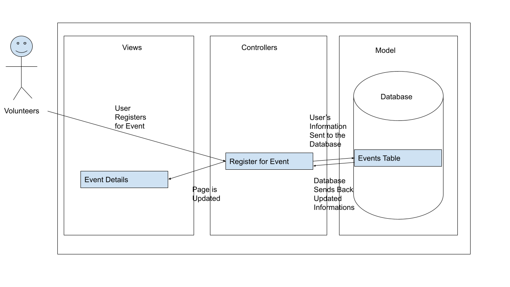
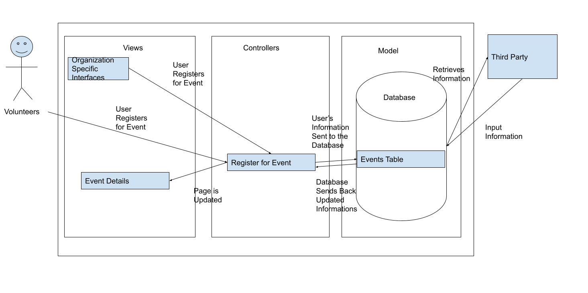

# Lab Report: Continuous Integration
___
**Course:** CIS 411, Spring 2021  
**Instructor(s):** [Trevor Bunch](https://github.com/trevordbunch)  
**Name:** Roman Searle  
**GitHub Handle:** RomanSearle 
**Repository:** (https://github.com/RomanSearle/cis411_lab2_arch) 
**Collaborators:** 
- @mcjo163 (completed steps 1, 2, and started 3.1 together)
- @AryurD0nnelly (all steps created or reviewed/revised together)
- @alecclyde - clarified directions 
___
 
# Step 1: Confirm Lab Setup
- [x] I have forked the repository and created my lab report
- [x] I have reviewed the [lecture / discussion](../assets/04p1_SolutionArchitectures.pdf) on architecture patterns.
- [x] If I'm collaborating on this project, I have included their handles on the report and confirm that my report is informed, but not copied from my collaborators.
 
# Step 2: Analyze the Proposal
The system is designed to connect volunteer events with those who wish to volunteer. This will be done by location radius and allow the user to create an account and register for events they are interested in. 
 
## Step 2.1 Representative Use Cases  
 
| Use Case #1 | Find and Register |
|---|---|
| Title | Volunteer |
| Description | This use case describes how a volunteer will go about finding and registering for an event. |
| Steps | 1. The volunteer will click on the events tab at the bottom of the application.  2. The volunteer views a list of local events sorted by proximity.  3. The volunteer can select an event to see more information about the event.  4. The volunteer decides to register.  4a. The volunteer clicks register and their information is entered from their  profile.  4b. The volunteer's information is sent to the database.  4c. The number of attendees for the event is updated.  5. The volunteer does not want to register.  5a. The volunteer can close the event details to go back to the event list. |
| Primary Actor | Volunteer |
| Preconditions | 1. The volunteer has registered an account. 2. The volunteer allows their location to be collected. |
| Postconditions | 1. The volunteer has their data stored in the database for the event. 2 The volunteer is registered for the event.|
 
| Use Case #2 | Create an event |
|---|---|
| Title | Service Agency |
| Description  | This use case describes how a service agency can register an event. |
| Steps | 1. The service agency employee clicks on a button to create a new event.   2. The service agency employee enters event information about the event such as maximum number of attendees, location, name, etc.  3. The event's information is sent to the database. 
 4. The event shows up in the events list. | 
| Primary Actor | Service Agency Employee |
| Preconditions | 1. The service agency has an account.  |
| Postconditions | 1. The event information is stored in the database.  2. The event is displayed to users withing the proximity. |
 
## Step 2.2 Define the MVC Components
 
| Model      | Service Agency Table | Volunteer Table | Events Table       | Type of Event |
|------------|----------------------|-----------------|--------------------|---------------|
| View       | Schedule an Event    | Profile         | Event Details      | Map           |
| Controller | Register Account     | Login           | Register for event | Local Area    |
 
## Step 2.3 Diagram a Use Case in Architectural Terms

In this use case, the volunteer will interact with the controller to sign up for an event. The controller will then interact with the events table model in the database to send the volunteer information and retrieve the updated information the controller requests. The controller then updates the event details view and the volunteer can see they are registered.
# Step 3: Enhancing an Architecture
 
## Step 3.1 Architecture Change Proposal
 
I recommend not changing the architecture. This is because MVC is capable of handling both of the new requests without much of a hassle. MVC can easily allow another organization to embed the view inside another webpage. MVC can also allow a third party service to use the database with relative ease. 

 Benefits 
- The architecture is already in place saving time and money.
- MVC can complete both of the tasks relatively well.
  
 Drawbacks
- It can be hard to have many different views from the small amount of models.
 
## Step 3.2 Revised Architecture Diagram

None of the original functionality has been changed. The specific organization interfaces will interact with the register for the event controller and then follow the same process as if the volunteer were interacting with the controller. The third party will be given direct access to the database indicated by the ability to retrieve information from and input information to the database.
# Step 4: Scaling an Architecture
The architectural patterns I will employ to meet these needs would be the load balancing, blackboard, broker, and client service architectural patterns. I selected load balancing to decrease the latency caused by having such a large number of new volunteer opportunities. The downsides of load balancing are if there is only one load balancer there is a single point of failure and that there is not any fault tolerance. Blackboard was selected to deal with certain events having large amounts of stored data. Blackboard will allow the company to use and manage large data sets with relative ease. The main problem with blackboard is that if the structure of the foundational data changes, blackboard can cause complex change management. To allow authorized parities to traverse the database, I choose to use a broker architecture. Broker will allow the company to give select parties access to the broker to then access the database. The main problem with broker is that it can add complexity to smaller projects. To allow researchers to examine patterns of volunteer opportunities a client server architecture was chosen. With this architecture the company would have one server with all of the data the researchers would need and give them access to the server. The main problem with client server architecture is that it is not scalable and has session management issues. In this case I do not see these concerns as major problems because this server would exclusively be maintained and for the researchers. 
 
 All of these changes are needed because of the rapid growth of the application. With this growth it is important to put in the proper architecture to ensure as the company continues to grow there is a solid foundation to build upon in the future. 
 
Articles:
https://dealna.com/en/Article/Post/693/Load-Balancing-Do-the-Cons-Balance-the-Pros
