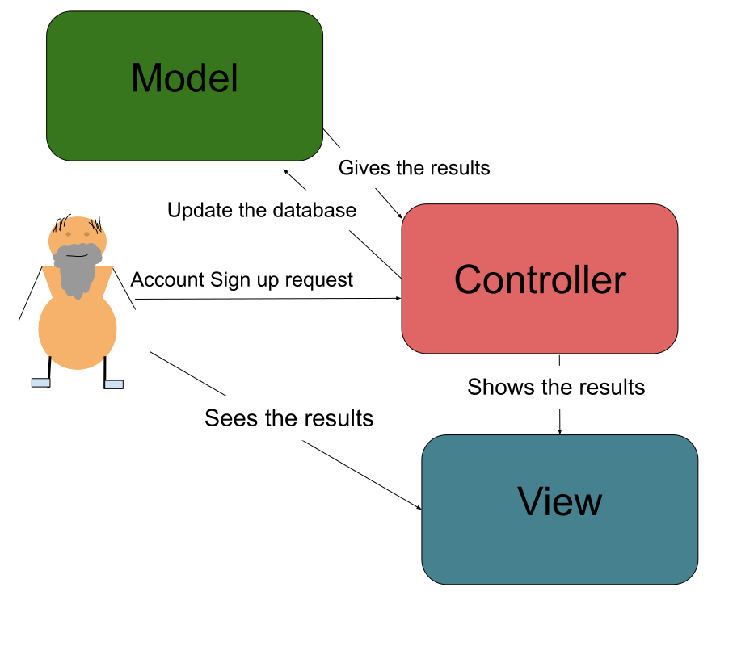

# Lab Report: Continuous Integration
___
**Course:** CIS 411, Spring 2021  
**Instructor(s):** [Trevor Bunch](https://github.com/trevordbunch)  
**Name:** [Seth Donnelly](https://github.com/ArturD0nnelly)     
**GitHub Handle:** ArturD0nnelly    
**Repository:** [cis411_lab2_arch](https://github.com/ArturD0nnelly/cis411_lab2_arch)   
**Collaborators:** 
___

# Step 1: Confirm Lab Setup
- [x] I have forked the repository and created my lab report
- [x] I have reviewed the [lecture / discsussion](../assets/04p1_SolutionArchitectures.pdf) on architecture patterns.
- [x] If I'm collaborating on this project, I have included their handles on the report and confirm that my report is informed, but not copied from my collaborators.

# Step 2: Analyze the Proposal
This application would help people to find more volunteer opportunities. The application would also organize the organization's information and event locations to make the experience of finding the volunteer position easier.   

## Step 2.1 Representative Use Cases  

| Use Case #1 | Volunteering |
|---|---|
| Title | Signing up to volunteer at the service event |
| Description / Steps | This use case is about how volunteers would sign up for the volunteering event. |
| Primary Actor | The Volunteer |
| Preconditions | Successful background check. The volunteer successfully signs up for the account. The volunteer meets the requirements. There is a Volunteering event to sign up for. |
| Postconditions | The service agency has a list of all applicants. The volunteer is notified about more fourth instructions (ex. apology email about not getting in or the congratulation email with data and time of the interview). |

| Use Case #2 | Creating Voluntireenig event |
|---|---|
| Title | Publish the service even |
| Description / Steps | This use case is about how the Service Agency would advertise the volunteering opportunity that is hosted by the service even host. |
| Primary Actor | The Servide Agent |
| Preconditions | The organization is registered as a service agency. The service agency has a list of service events advertisement requests. |
| Postconditions | The event information was added to the database. The service event is published on the application/website of the service agency. |

## Step 2.2 Define the MVC Components

| Model | View | Controller |
|---|---|---|
| Agency | Servise Agency Page | EventAdvertisment |
| Event Host | Volunteering Page | CreateEvent |
| Volunteer | Sighn Up Page | AccountSignUp |
| Event Details | Event Page | EventSignUp |

## Step 2.3 Diagram a Use Case in Architectural Terms

For volunteers to sign up for the event the request has to be sent to the controller, where the controller will send the information to the model for the update. The module then will send the results back to the controller, and the controller then will send it to the view for the user to visualize it. And then users can see that they were signed up for the service event. 

# Step 3: Enhancing an Architecture

## Step 3.1 Architecture Change Proposal
I would say that using MVC, in this case, would be ideal. One of the benefits of continuing to use MVC would be the fans that MVC is easy to adopt. So, it wouldn't be too complicated to update the already existing MVC model. Since we are building another interface on top of the Serve Central, the potential issue would be difficulties in supporting multiple similar views on the same model.

## Step 3.2 Revised Architecture Diagram

In this diagram, I have added the Third Party that is connected to the Model so that information can be traded between the Model and Third-Party Services. I have also added Organization's Interface to the Controller. So, if the user is signing up for the even from the outside of the organization the interface would look different than if the user is signing up from the organization page.

# Step 4: Scaling an Architecture
INSERT Architectural change proposal here, and how it meets the four new requirements.  Explain both the benefits and draw backs of your proposal.  If the changes are significant, then you need to explain why the changes are necessary versus a nice-to-have enhancement.

# Extra Credit
If you opt to do extra credit, then include it here.