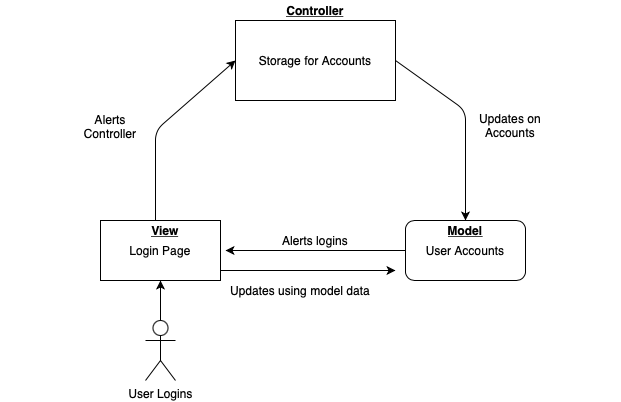
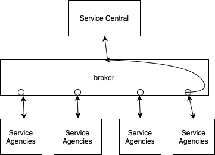

# Lab Report: Continuous Integration
___
**Course:** CIS 411, Spring 2021  
**Instructor(s):** [Trevor Bunch](https://github.com/trevordbunch)  
**Name:** Emily Lopez  
**GitHub Handle:** el1303
**Repository:** el1303/cis411_lab2_arch  
**Collaborators:** tim12-code, hallienicholas
___

# Step 1: Confirm Lab Setup
- [X] I have forked the repository and created my lab report
- [X] I have reviewed the [lecture / discsussion](../assets/04p1_SolutionArchitectures.pdf) on architecture patterns.
- [X] If I'm collaborating on this project, I have included their handles on the report and confirm that my report is informed, but not copied from my collaborators.

# Step 2: Analyze the Proposal
Serve Central ... ENTER A BASIC SYSTEM INTRODUCTION HERE (1-2 Sentences).

Serve Central is an web and mobile application that has a list of volunteering opportunities. 

## Step 2.1 Representative Use Cases  

| Use Case #1 | |
|---|---|
| Title | Volunteers will look at service opportunities being able to give time where needed. |
| Description / Steps | User creates there account and finds what locations are available to sign up for in the application through the service. |
| Primary Actor | Volunteer |
| Preconditions | 1. The volunteer signs in.  2. User needs an opportunity 3. Location access needs to be accepted on user's phone. |
| Postconditions | 1. Confirmation of when accepted for the opportunity signed. 2. Volunteers can help with different events. |

| Use Case #2 | |
|---|---|
| Title | Server displaying events so volunteers can sign up for. |
| Description / Steps | Service agencies looking for volunteers and give the information needed for event. |
| Primary Actor | Service Agencies |
| Preconditions | 1. Server must be looking for volunteers 2.Agency must be hosting the event |
| Postconditions | 1. Agencies host events. 2. Send out confirmations for the users and host the events|

## Step 2.2 Define the MVC Components

| Model | View | Controller |
|---|---|---|
| Business | service agency | promoting business |
| Location | volunteer opportunities | creating volunteer opportunities |
| Event | event orientation | signup for event |
| Profile | account page | Account signup |

## Step 2.3 Diagram a Use Case in Architectural Terms
 

This diagram shows the MVC components in which is the view of login page, the user accounts and the controller is the storage functional process for the account. The user goes through the login page which is the view model. Then the controller gets an alert to process and store what is needed. Then the controller updates the users account which alerts the model for the login page. Updating what's been alerted to send data back to view.

# Step 3: Enhancing an Architecture

## Step 3.1 Architecture Change Proposal

Serve Cental has the advantage to expand their business nationally. They are receiving volunteers as a third party through US. As Serve Central expands their business the most effective architectural pattern is the broker architecture. Broker architecture is a way to communicate between those involved in the different parties giving the request to the server and display the results to those who are involved. The parties who aren't local would benefit from the broker because everyone would be able to communicate amongst this architecture. Along with security in the midst of the sending and receiving. For the local churches they will be able to do the same in communication with also security limited to those who have to have allowance with the services. It would also be difficult because everything would take some time to get posted but everyone will be able to make and receive the changes.

## Step 3.2 Revised Architecture Diagram

Broker diagram explains how Serve Central receives information from service agencies.

# Step 4: Scaling an Architecture

Serve Central expanded tremendously making room for various opportunities. Since their expansion they need a space where changes can be made instantaneously for their web and application. Peer to peer architecture pattern would be the best fit using github for the changes to not clash. Github opens for changes to be received despite of the time or place the changes are made from. By expanding with peer to peer, it allows the instantaneous transmission of data to happen rather than broker architecture. With all the data that would be stored it will be easier to manage through the network rather than a server. Along with the large network it would allow all parties to submit what needs to in the database. As it expands their will be more security also for their not to be any issues with outsource or cyber attacks.

# Extra Credit
If you opt to do extra credit, then include it here.