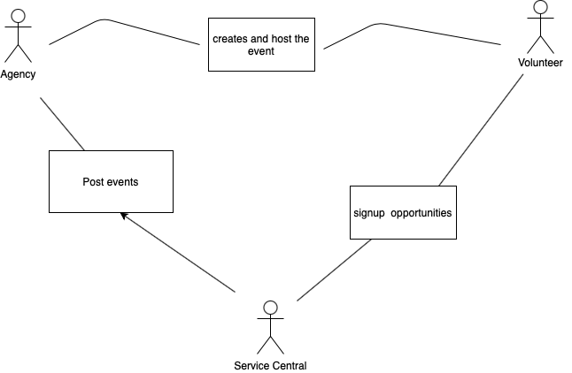

# Lab Report: Continuous Integration
___
**Course:** CIS 411, Spring 2021  
**Instructor(s):** [Trevor Bunch](https://github.com/trevordbunch)  
**Name:** Emily Lopez  
**GitHub Handle:** el1303
**Repository:** el1303/cis411_lab2_arch  
**Collaborators:** tim12-code, hallienicholas
___

# Step 1: Confirm Lab Setup
- [X] I have forked the repository and created my lab report
- [X] I have reviewed the [lecture / discsussion](../assets/04p1_SolutionArchitectures.pdf) on architecture patterns.
- [X] If I'm collaborating on this project, I have included their handles on the report and confirm that my report is informed, but not copied from my collaborators.

# Step 2: Analyze the Proposal
Serve Central ... ENTER A BASIC SYSTEM INTRODUCTION HERE (1-2 Sentences).

Serve Central is an web and mobile application that has a list of volunteering opportunities. 

## Step 2.1 Representative Use Cases  

| Use Case #1 | |
|---|---|
| Title | Volunteer Opportunities|
| Description / Steps | User creates there account and finds what's available to sign up for in the application. |
| Primary Actor | Volunteer |
| Preconditions | User needs an opportunity |
| Postconditions | Confirmation of when accepted for the opportunity signed|

| Use Case #2 | |
|---|---|
| Title | Server looking for volunteers|
| Description / Steps | Service agencies looking for volunteers |
| Primary Actor | Service Agencies |
| Preconditions | Server must be looking for volunteers |
| Postconditions | Send out confirmations for the users and host the events|

## Step 2.2 Define the MVC Components

| Model | View | Controller |
|---|---|---|
| Business | service agency | promoting business |
| Location | volunteer opportunities | creating volunteer opportunities |
| Event | event orientation | signup for event |
| Profile | account page | Account signup |

## Step 2.3 Diagram a Use Case in Architectural Terms
 
Serve central displays the sign up opportunities for volunteers and post events for agencies. The agencies create and host the event for volunteer.

# Step 3: Enhancing an Architecture

## Step 3.1 Architecture Change Proposal

Serve Cental has the advantage to expand their business nationally. They are receiving volunteers as a third party through US. Serve central also built a way to include a link to volunteer registration in church websites websites. 

## Step 3.2 Revised Architecture Diagram

Broker diagram explains how Serve Central receives information from service agencies.

# Step 4: Scaling an Architecture
INSERT Architectural change proposal here, and how it meets the four new requirements.  Explain both the benefits and draw backs of your proposal.  If the changes are significant, then you need to explain why the changes are necessary versus a nice-to-have enhancement.

Serve Central expanded tremendously making room for various opportunities. Since their expansion they need a space where changes can be made instantaneously for their web and application. Peer to peer architecture pattern would be the best fit using github for the changes to not clash. Github opens for changes to be received despite of the time or place the changes are made from.

# Extra Credit
If you opt to do extra credit, then include it here.