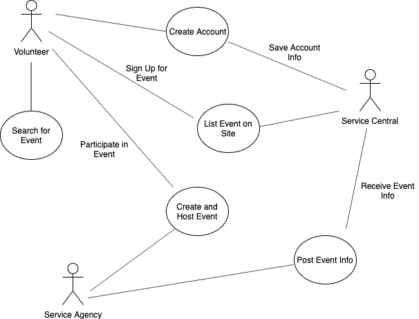
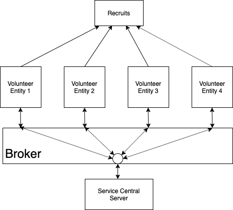
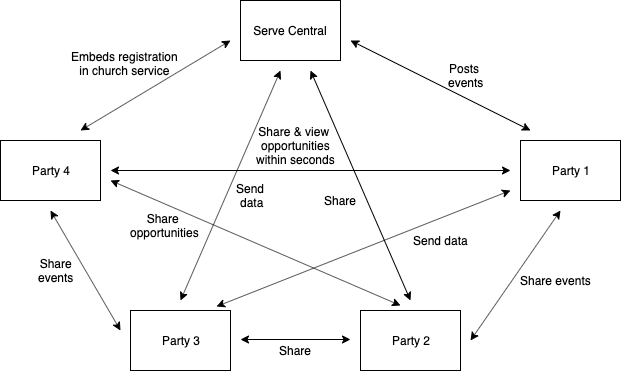

# Lab Report: Continuous Integration
___
**Course:** CIS 411, Spring 2021  
**Instructor(s):** [Trevor Bunch](https://github.com/trevordbunch)  
**Name:** Hallie Nicholas  
**GitHub Handle:** hallienicholas  
**Repository:**  hallienicholas/cis411_lab2_arch   
**Collaborators:** @el1303 @Tim12-code
___

# Step 1: Confirm Lab Setup
- [x] I have forked the repository and created my lab report
- [x] I have reviewed the [lecture / discsussion](../assets/04p1_SolutionArchitectures.pdf) on architecture patterns.
- [x] If I'm collaborating on this project, I have included their handles on the report and confirm that my report is informed, but not copied from my collaborators.

# Step 2: Analyze the Proposal
Serve central is an application which stores information about service activities and locations on the database and allows for users to see what opportunities are around them to serve the community. Along with being able to find an event, users can sign up for the event through the app as well, which ensures a smooth overall experience and is an easy way for people to learn about service opportunities and events.

## Step 2.1 Representative Use Cases  

| Use Case #1 | |
|---|---|
| Title | As a volunteer I want to look for service opportunities so I can be helpful and give my time to others.|
| Description / Steps | This use case describes how the volunteer finds a service opportunity based on location and signs up through the service.|
| Primary Actor | Volunteer|
| Preconditions | 1. Volunteer is signed in 2. Volunteer needs an opportunity 3. Location access is enabled on user's phone|
| Postconditions | 1. Volunteer is sent a confirmation of signup 2. Volunteer has an opportunity to help with an event|

| Use Case #2 | |
|---|---|
| Title | As the service agency, I want to list a hosted event so I can have a good number of volunteers help out. |
| Description / Steps | Agency is looking for volunteers and gives their information to the application's database|
| Primary Actor | Service Agencies |
| Preconditions | 1. Service agency must be looking for volunteers 2. Agency must be hosting an event|
| Postconditions | 1. Agency hosts the event 2. Agency notified of signups|

## Step 2.2 Define the MVC Components

| Model | View | Controller |
|---|---|---|
| Service events listed in database | Event page in the program | Ability for volunteers to sign up for events|
| Reporting function | Information about each reported event | Record of each event our service receives info about |
| User accounts | Login page | Ability to store password and user info |
| Data receiving | Updated database with information received from service agencies | Ability to receive and store incoming data |

## Step 2.3 Diagram a Use Case in Architectural Terms

This diagram represents the interactions between the actors in the use case we are currently studying. The actors are the volunteers, the service agencies that host service events and Service Central. First, a volunteer creates an account with Service Central and searches for an event. Then, the application saves the account information in the database. The service agency creates and hosts an event, which the volunteer signs up for and participates in. The reason a volunteer is able to sign up for an event is because the agency posts information about it such as where it is located and when it will occur. Service Central then receives the information about the event and lists it on their site for the volunteer to view and register for.

This diagram is showing a set of MVC components for this situation in which the model is the user accounts, the view is the login page and the controller is the ability for the database to store a password. In this relationship, the user first interacts with the login page which is the view in this model. Then the login page alerts the controller of the information it has received, and goes to the function that needs to be performed (the controller) which is to store the password it has received. After this, the controller updates the user accounts which are the entities in the database. The model then alerts the login page that it has changed and then uses that data to update the view.
# Step 3: Enhancing an Architecture
## Step 3.1 Architecture Change Proposal
If Serve central were to expand their services and need to be receiving events and opportunities from across the country, I believe the most effective architectural pattern would be broker architecture. This architecture breaks up services through a broker or middle component. This component coordinates communication between parties, forwards requests to the main server and transmits results and exceptions to all involved. This pattern would be beneficial in these circumstances because first of all, the third party services would be able to send and receive data from Service Central, but there would still be security involved and the head server’s data would be more protected. Because they would have four more entities from across the country, it would be a good idea to monitor what is going on between them and the server. Local churches would also be able to embed registration services in their websites this way with permission. Due to the fact that they would have to go through the broker, it is a little more complicated, but it is ensuring safety for all users and components involved. Therefore, it would be smart and manageable in these circumstances because they only added on four primary volunteer entities in the country. A downside of this architectural pattern would be that it would take a little bit longer for opportunities and events to be posted. The broker is sorting all the messages and communication before it reaches the main server, so it wouldn’t be instantaneous; however, it would be secure.

## Step 3.2 Revised Architecture Diagram

# Step 4: Scaling an Architecture
Due to this grant which would expand the service exponentially, a new architectural pattern would need to be implemented. I believe peer to peer architecture would be best for the case because it allows for equal control among all nodes or parties involved. This would be very convenient in this situation because if there are over 10000 new volunteer opportunities per hour and they want low latency, there will need to be an almost instantaneous transmission of data, which we already established above couldn’t happen using broker architectural patterns. Peer to peer is optimized for this due to the lack of a central server, eliminating the middle component and extra process time. In addition, there is a large amount of data which would be better off stored on the network and distributed to all the entities rather than on a single server. Also, anyone would be able to access this data, which means that parties could issue queries that everyone would see in the database and researchers would additionally be able to make future predictions and investments based on what they see. This change would be necessary because with a broker architecture pattern there is more wait time due to the middle component as I stated above. Also, in order for outside investors such as researchers to look inside our database and make predictions, it would need to be more open-source and accessible through more means than the broker. A potential issue here is that it is difficult to backup all of that data because it is not on a centralized server. Therefore, if something were to happen and data was lost, it would be extremely hard to get it back, and service agencies might not be notified of the loss because they wouldn’t know their inputted data was gone to begin with. Also, security is an issue in a decentralized environment such as this due to the fact that all the nodes would have access to the data. However, there are ways to build up the architecture to be more secure such as creating firewalls to monitor incoming and outgoing traffic and ensure a higher level of safety for users.

# Extra Credit

This diagram is an example of what the architecture would look like if it had grown exponentially and peer to peer architectural patterns were used. I have included 5 main nodes speaking with one another and sharing data with each other about upcoming opportunities. They all hear about the events at the same time and share them with the whole network. I have also included some other actions that can occur between nodes such as registration being embedded in church services, events being posted, and opportunities being viewed. Due to the peer to peer organization of this network, when a piece of data is transmitted and committed, the whole network will see their server updated based on that information which is valuable in a large setting such as this.