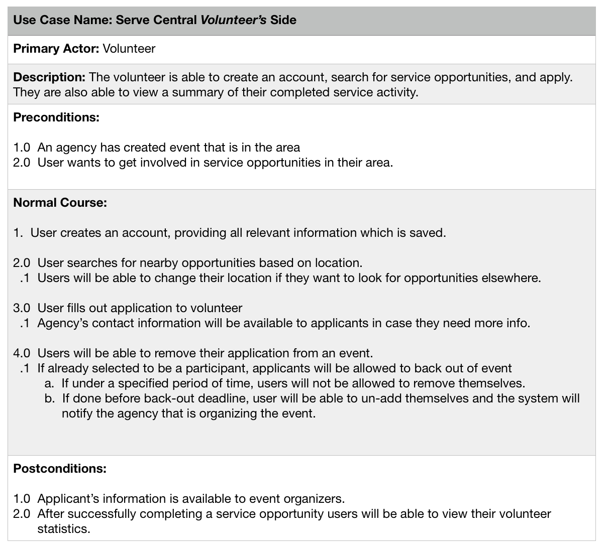
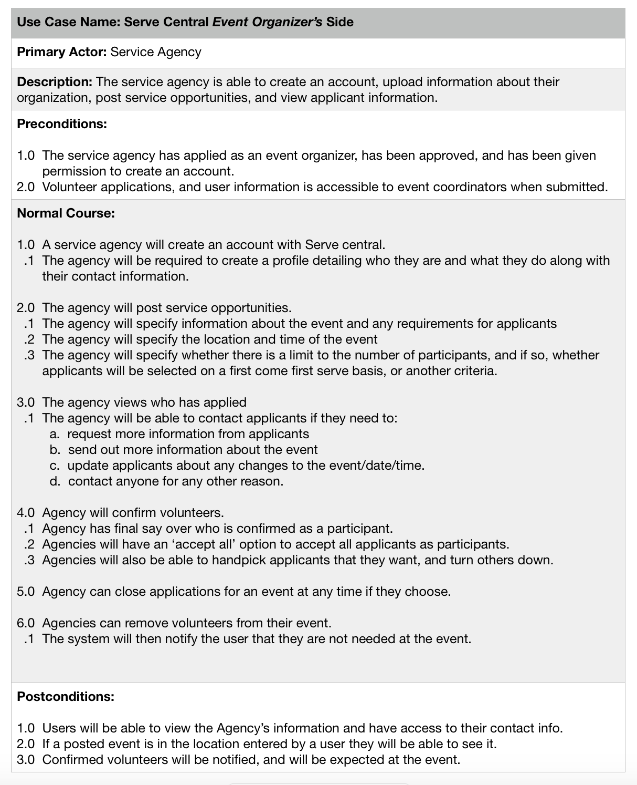
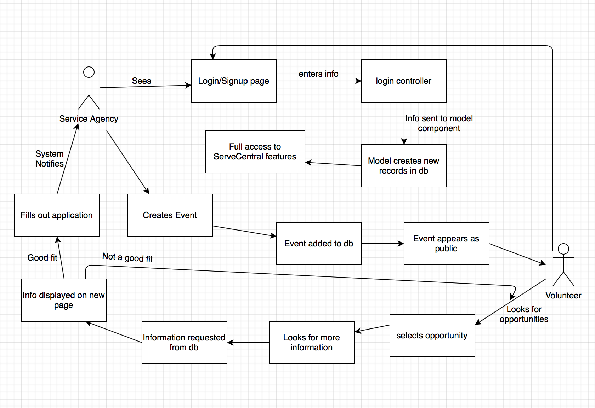
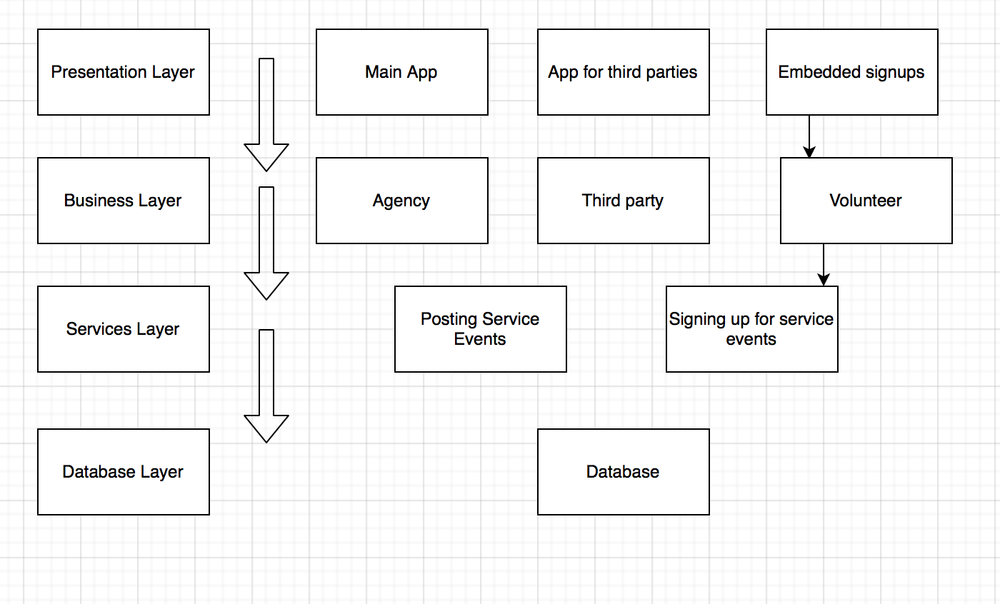

# Lab Report: Continuous Integration
___
**Course:** CIS 411, Spring 2021  
**Instructor(s):** [Trevor Bunch](https://github.com/trevordbunch)  
**Name:** Isaac Parada  
**GitHub Handle:** isaacparada  
**Repository:** isaacparada/cis411_lab2_arch  
**Collaborators:** 
___

# Step 1: Confirm Lab Setup
- [x] I have forked the repository and created my lab report
- [x] I have reviewed the [lecture / discsussion](../assets/04p1_SolutionArchitectures.pdf) on architecture patterns.
- [ ] If I'm collaborating on this project, I have included their handles on the report and confirm that my report is informed, but not copied from my collaborators.

# Step 2: Analyze the Proposal
Serve Central ... ENTER A BASIC SYSTEM INTRODUCTION HERE (1-2 Sentences).

Serve Central helps people to find volunteer service opportunities in their commuinity. It displays local events to users and provides an easy application process for those looking to join an event.
## Step 2.1 Representative Use Cases  

Use Case #1

Use Case #2

## Step 2.2 Define the MVC Components

| Model | View | Controller |
|---|---|---|
| Check Login credentials, add new records for new accounts| Login/signup page | Handle login request |
| Update user/agency information, or Access statistics | Home screen | Home screen features & app navigation|
| Add public events & Querry for nearby events | Events list | Event features|
| Access  event/ organization information | Event/organization pages| Handle requests for all event/organizer pages|

## Step 2.3 Diagram a Use Case in Architectural Terms

The main MVC component here is the login system where the user (a volunteer or service agency) creates their account. The information they enter is passed from the dynamic web page through the controller to the model where it is added to the database as a new record. I also included (in less detail) the process of listing and signing up for events. 

# Step 3: Enhancing an Architecture

## Step 3.1 Architecture Change Proposal
I think I would stick with MVC, probably try to adapt over to the rails architecture. However, I could also see a layered architecture working really well for this scenario. For the first change (the third party integration) a services layer in a layered architecture would allow for anbling those features. For the second change, you could create a specific interface on the presentation layer made specifically for another church to use. This would allow them to use the entire platform while having a unique interface for their needs. 

From what I have read, one of the drawbacks with this architecture is that scalability can become an issue when new third parties require new features. A change to one layer means the entire system has to be changed to accomodate that change. This can be very costly and time consuming.

## Step 3.2 Revised Architecture Diagram

# Step 4: Scaling an Architecture

Here I would switch to a microservice architecture like Twitter. This platform is not very complicated. I think the developers could easily get away with creating specific services for each of the new requirements along with the older ones. Specific services devoted just to allowing researchers access to the database will streamline their access. Having 10k+ new volunteer opportunities per hour we would need a fast way to get those sorted, and a dedicated service to that would be efficient. 

Major drawback #1 is the develpement time. Creating each unique service will take time. Drawback #2 is that if third parties and researching do too much querrying of the database it can greatly slow down other important features of the site like the casual user's experience. 

# Extra Credit
If you opt to do extra credit, then include it here.