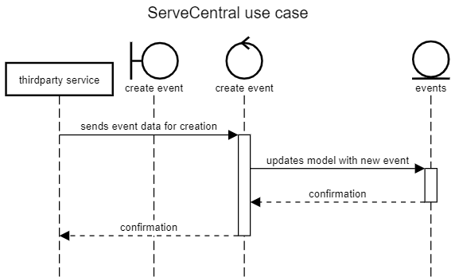

# Lab Report: Continuous Integration

___
**Course:** CIS 411, Spring 2021  
**Instructor(s):** [Trevor Bunch](https://github.com/trevordbunch)  
**Name:** Micah Johnson  
**GitHub Handle:** @mcjo163  
**Repository:** [mcjo163/cis411_lab2_arch](https://github.com/mcjo163/cis411_lab2_arch)  
**Collaborators:** @RomanSearle (use case diagrams and initial architecture), @airgo32 & @scribhneoir (discussing architecture changes)
___

## Step 1: Confirm Lab Setup

- [x] I have forked the repository and created my lab report
- [x] I have reviewed the [lecture / discsussion](../assets/04p1_SolutionArchitectures.pdf) on architecture patterns.
- [x] If I'm collaborating on this project, I have included their handles on the report and confirm that my report is informed, but not copied from my collaborators.

## Step 2: Analyze the Proposal

Serve Central is a hub for people who want to volunteer but don't know how to find events to volunteer for. It uses location data to show users events that are close by to them, and keeps track of the user's volunteering history.

### Step 2.1 Representative Use Cases  

| Use Case #1 | Find and Register |
|---|---|
| Title | Volunteer |
| Description | This use case demonstrates how users will find and register for volunteer events. |
| Primary Actor | Volunteer |
| Preconditions | **1.** The volunteer has an account and is signed in.  **2.** The volunteer has allowed access to their location.   **3.** There are available events near the volunteer. |
| Steps | **1.** The volunteer logs into their account.   **2.** The volunteer browses the map for nearby open events.   **3.** The volunteer may select an event from the map, or navigate to the list tab from the bar on the bottom.   **4.** If the volunteer selects an event from the map,  &nbsp; **a.** The application displays the information associated with the selected event.  &nbsp; **b.** The volunteer may register for the event or return to the map.   **5.** If the volunteer navigates to the list page, events are displayed in order of proximity.   **6.** The user may select an event from the list, and may register in the same way as if they had navigated from the map. |
| Postconditions | **1.** The volunteer's information has been stored in the database location associated with the event. |

| Use Case #2 | Post Event |
|---|---|
| Title | Service Agency |
| Description | This use case demonstrates how service agencies will post events for volunteers to register for. |
| Primary Actor | Service Agent |
| Preconditions | **1.** The service agent has an account associated with an organization. |
| Steps | **1.** The service agent logs into their account.   **2.** Since the account is associated with an organization, the application offers the option to add a new event.   **3.** The service agent selects this option and enters the relevant information about the event (title, address, description, etc.).   **4.** The service agent selects 'post' and confirms that the information is entered correctly. |
| Postconditions | **1.** The newly added event is in the database and can be viewed by volunteers. |

### Step 2.2 Define the MVC Components

| Model | View | Controller |
|---|---|---|
| events | event | log in |
| volunteer users | log in | register for event|
| service agency users | event list | create event |
| event categories | profile | get event data |
|  | create event | get profile data |

### Step 2.3 Diagram a Use Case in Architectural Terms

A volunteer user selects an event from either the list or map.

## Step 3: Enhancing an Architecture

### Step 3.1 Architecture Change Proposal

These changes can be implemented with a (slightly more complex) MVC structure. The thirdparty data flow can be done using a new special user/actor that interfaces directly with the controllers. The organization specific interfaces could be accomplished using iframes (not completely ideal, but still valid, I think).

The main benefit of sticking with the MVC structure is not having to restructure the entire application. The controller structure does also provide an efficient way to allow third parties to interface directly with the data in a safe way.

However, using iframes would not be the most ideal way to allow for organization-specific interfaces. It would work, as they could embed the profile or events page for their organization, but there are better ways to do this. Ultimately, I believe that it would still be worth sticking with the MVC structure to avoid a complete restructure, and also because of how well it would to create an API for third party services.

### Step 3.2 Revised Architecture Diagram

Here is an overview of the changes, with a specific example of the API use to follow.

The data sent from the thirdparty service bypasses the normal 'create event' view and works directly with the controller.

The proposed solution for organization-specific interfaces uses iframes, which would not require any architectural change.

## Step 4: Scaling an Architecture

In its current state, the architecture would be unable to realistically handle the influx of data, users, and requests, and so it needs to be updated.

I believe that the architecture should be changed to a microservice system. To handle the large volumes of data, a broker/load balancer-like system would be employed within the microservice structure. The lightweight archictecture would have individually optimized components that would be able to handle the vast increase in traffic. The broker-like system would allow for multiple data servers to be connected together and conjoined to store the terabytes of data. The broker system could plausibly be implemented by a subset of the microservice system devoted to it. The last two requirements can be boiled down to basically the same thing: data processing. Again, the microservice structure's lightweight and optimized framework would be great for this.

I would say that this problem space is fairly well-understood and would thus lend itself well to microservices. Plus, the architecture is very flexible and could easily evolve to handle the dramatic changes that seem to be required of ServeCentral quite often.
